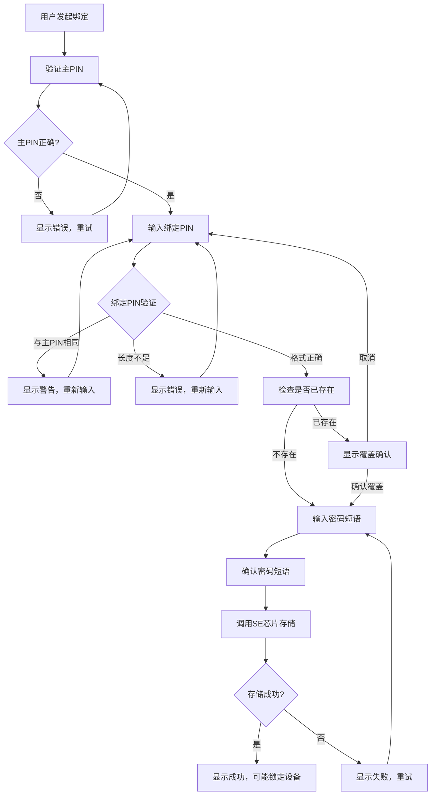
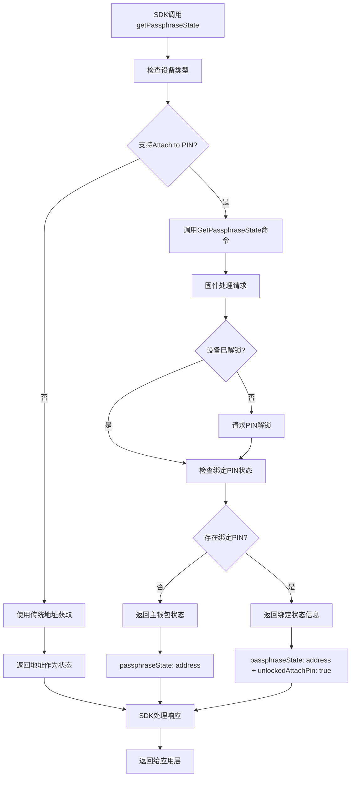
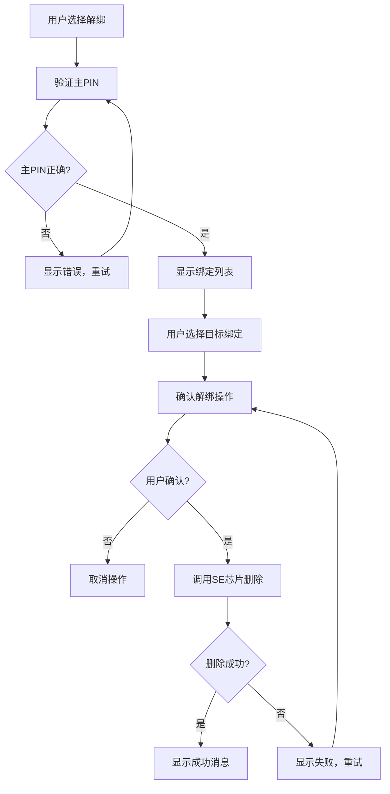

# OneKey Attach to PIN 技术详解

## 0. 核心概念说明

### 0.1 什么是 Attach to PIN

**🔑 核心理解：**
```
Attach to PIN = 将密码短语(Passphrase)绑定到特定PIN码
目标：简化隐藏钱包的访问流程，提升用户体验
```

| 传统模式 | Attach to PIN 模式 |
|---------|-------------------|
| 输入主PIN → 输入密码短语 | 输入绑定PIN → 自动应用密码短语 |
| 每次都需要手动输入密码短语 | 一次绑定，后续自动应用 |
| 密码短语容易输错或遗忘 | PIN码更简单，不易出错 |
| 适合技术用户 | 适合普通用户 |

**💡 形象比喻：**
```
传统模式 = 每次开门都要输入复杂密码
Attach to PIN = 设置简单门禁卡，刷卡即可进入特定房间
```

### 0.2 安全模型

**安全边界：**
- **主PIN**: 保护设备基础访问权限
- **绑定PIN**: 保护特定密码短语的访问权限
- **密码短语**: 实际的密钥推导参数，存储在安全芯片中

**威胁模型：**
- ✅ 防护：设备丢失、PIN码泄露
- ✅ 防护：密码短语遗忘、输入错误
- ⚠️ 风险：绑定PIN与主PIN相同时的安全降级

## 1. Attach to PIN 核心原理

### 1.1 技术架构

**系统架构图：**

```
┌─────────────────────────────────────────────┐
│           应用层：钱包 App                    │
├─────────────────────────────────────────────┤
│      业务层：地址生成、交易签名、账户管理      │
├─────────────────────────────────────────────┤
│    密钥推导层：BIP32 HD 钱包 + Passphrase    │ ← 统一汇聚点
├─────────────────────────────────────────────┤
│   Attach to PIN 层：PIN-Passphrase 映射     │ ← 核心创新
├─────────────────────────────────────────────┤
│      安全存储层：SE 安全芯片 + 加密存储        │ ← 关键保护
├─────────────────────────────────────────────┤
│      硬件抽象层：OneKey 固件接口              │
├─────────────────────────────────────────────┤
│    密码学层：AES + PBKDF2 + ECDSA + SHA256   │ ← 底层算法
└─────────────────────────────────────────────┘
```

### 1.2 核心组件

**关键模块：**

| 组件 | 功能 | 实现位置 | 安全等级 |
|------|------|----------|----------|
| **SE THD89** | 安全芯片存储 | `trezor.crypto.se_thd89` | 🔴 最高 |
| **PIN 验证** | 多重PIN验证 | `apps.common.request_pin` | 🟡 高 |
| **密码短语管理** | 加密存储映射 | `apps.common.passphrase` | 🟡 高 |
| **UI 交互** | 用户界面流程 | `trezor.ui.layouts.lvgl` | 🟢 中 |

### 1.3 存储机制

**安全芯片存储结构：**
```typescript
interface AttachToPinStorage {
  // 主PIN验证后的加密存储
  encryptedMappings: {
    [bindingPinHash: string]: {
      encryptedPassphrase: Buffer;  // AES加密的密码短语
      salt: Buffer;                 // 随机盐值
      iterations: number;           // PBKDF2迭代次数
      timestamp: number;            // 创建时间戳
    }
  };

  // 元数据
  metadata: {
    version: number;                // 存储格式版本
    maxEntries: number;             // 最大绑定数量
    currentCount: number;           // 当前绑定数量
  };
}
```

## 2. 核心 API 接口

### 2.1 固件端 API

**主要接口：**

```python
# 核心存储接口
se_thd89.save_pin_passphrase(
    main_pin: str,           # 主PIN码
    binding_pin: str,        # 绑定PIN码
    passphrase: str          # 密码短语内容
) -> Tuple[bool, bool]       # (保存成功, 需要锁定设备)

se_thd89.get_pin_passphrase(
    main_pin: str,           # 主PIN码
    binding_pin: str         # 绑定PIN码
) -> Tuple[bool, str]        # (获取成功, 密码短语内容)

se_thd89.remove_pin_passphrase(
    main_pin: str,           # 主PIN码
    binding_pin: str         # 绑定PIN码
) -> bool                    # 删除成功

se_thd89.list_pin_passphrase(
    main_pin: str            # 主PIN码
) -> List[str]               # 绑定PIN列表
```

**PIN 验证接口：**

```python
# 多重PIN验证
config.check_pin(
    pin: str,                # PIN码
    salt: bytes,             # 盐值
    pin_type: PinType        # PIN类型
) -> Tuple[bool, PinResult]  # (验证成功, PIN类型结果)

# PIN类型枚举
class PinType:
    USER_CHECK = 1           # 主PIN验证
    PASSPHRASE_PIN_CHECK = 2 # 绑定PIN验证
    USER_AND_PASSPHRASE_PIN = 3  # 混合验证
```

### 2.2 SDK 端 API

#### 2.2.1 核心 API 接口

**主要方法：**

```typescript
interface CoreApi {
  // 设备管理
  getFeatures(connectId: string): Promise<Response<Features>>;

  // Attach to PIN 核心方法
  getPassphraseState(
    connectId: string,
    params?: GetPassphraseStateParams
  ): Promise<Response<GetPassphraseStateResponse>>;

  // 事件管理
  on(event: string, listener: Function): void;
  uiResponse(response: UiResponseEvent): void;
}
```

#### 2.2.2 关键类型定义

**GetPassphraseState 接口：**

```typescript
interface GetPassphraseStateParams {
  initSession?: boolean;        // 初始化新会话
  useEmptyPassphrase?: boolean; // 使用空密码短语
  onlyMainPin?: boolean;        // 仅使用主PIN
}

interface GetPassphraseStateResponse {
  passphraseState: string | undefined;      // 密码短语状态标识
  newSession: string | undefined;           // 新会话ID
  unlockedAttachPin: boolean | undefined;   // 是否通过绑定PIN解锁
}
```

**设备特性：**

```typescript
interface Features {
  device_id: string;
  model: string;
  major_version: number;
  minor_version: number;
  patch_version: number;
  pin_protection: boolean;
  passphrase_protection: boolean;
  unlocked: boolean;
  session_id: string;
  // ... 其他属性
}
```

#### 2.2.3 设备兼容性检测

**兼容性检测函数：**

```typescript
// 检测 Attach to PIN 支持
function hasAttachToPinCapability(features: Features): boolean {
  const deviceType = getDeviceType(features);
  const version = getDeviceFirmwareVersion(features).join('.');

  return (deviceType === EDeviceType.Pro && semver.gte(version, '4.15.0')) ||
         (deviceType === EDeviceType.Touch && semver.gte(version, '4.11.0'));
}

// 检测原生 API 支持
function hasNativePassphraseStateAPI(features: Features): boolean {
  const deviceType = getDeviceType(features);
  const version = getDeviceFirmwareVersion(features).join('.');

  return deviceType === EDeviceType.Pro && semver.gte(version, '4.15.0');
}
```

#### 2.2.4 事件系统

**事件类型：**

```typescript
// 事件常量
const UI_REQUEST = {
  REQUEST_PIN: 'ui-request_pin',
  REQUEST_PASSPHRASE: 'ui-request_passphrase',
} as const;

const UI_RESPONSE = {
  RECEIVE_PIN: 'ui-receive_pin',
  RECEIVE_PASSPHRASE: 'ui-receive_passphrase',
} as const;

// 事件消息
interface UiRequestPin {
  type: 'ui-request_pin';
  payload: {
    device: Device;
    type: 'ButtonRequest_PinEntry' | 'ButtonRequest_AttachPin';
  };
}

interface UiRequestPassphrase {
  type: 'ui-request_passphrase';
  payload: {
    device: Device;
    existsAttachPinUser?: boolean;  // 关键：是否存在绑定PIN用户
  };
}
```

## 3. 核心流程详解

### 3.1 绑定流程

**完整绑定流程图：**



**关键验证步骤：**

1. **主PIN验证**: 确保用户有权限进行绑定操作
2. **绑定PIN检查**: 防止与主PIN冲突，确保最小长度
3. **存在性检查**: 避免意外覆盖现有绑定
4. **密码短语确认**: 双重输入确认，防止输入错误
5. **安全存储**: 使用SE芯片加密存储映射关系

### 3.2 使用流程

**密码短语状态获取流程：**



### 3.3 解绑流程

**解绑操作流程：**



## 4. 安全机制详解

### 4.1 多层安全防护

**安全层级：**

```
第1层：设备物理安全
├── 安全芯片 SE THD89
├── 防篡改硬件设计
└── 安全启动验证

第2层：PIN码验证
├── 主PIN：设备基础访问
├── 绑定PIN：特定密码短语访问
└── 防暴力破解机制

第3层：密码学保护
├── AES-256 加密存储
├── PBKDF2 密钥推导
└── 随机盐值防彩虹表

第4层：会话管理
├── 临时会话状态
├── 自动超时锁定
└── 状态隔离保护
```

### 4.2 威胁模型分析

**潜在威胁与防护：**

| 威胁类型 | 攻击场景 | 防护机制 | 风险等级 |
|---------|----------|----------|----------|
| **设备丢失** | 物理设备被盗 | PIN码保护 + 硬件加密 | 🟡 中等 |
| **PIN泄露** | 主PIN被观察到 | 绑定PIN独立验证 | 🟡 中等 |
| **暴力破解** | 尝试所有PIN组合 | 失败次数限制 + 设备锁定 | 🟢 低 |
| **侧信道攻击** | 功耗/时序分析 | 安全芯片硬件防护 | 🟢 低 |
| **固件篡改** | 恶意固件植入 | 安全启动 + 签名验证 | 🟢 低 |
| **社会工程** | 诱骗用户操作 | 明确的UI提示 + 确认流程 | 🟡 中等 |

### 4.3 最佳安全实践

**推荐配置：**

```typescript
const SECURITY_RECOMMENDATIONS = {
  // PIN码设置
  mainPin: {
    minLength: 6,           // 最小长度
    complexity: 'medium',   // 复杂度要求
    avoidPatterns: true     // 避免简单模式
  },

  // 绑定PIN设置
  bindingPin: {
    minLength: 4,           // 最小长度（固件限制）
    differentFromMain: true, // 必须与主PIN不同
    maxBindings: 10         // 最大绑定数量
  },

  // 密码短语设置
  passphrase: {
    minLength: 1,           // 最小长度
    maxLength: 50,          // 最大长度
    encoding: 'utf8',       // 字符编码
    backup: 'required'      // 必须备份
  }
};
```

**安全检查清单：**

- ✅ 主PIN与绑定PIN不相同
- ✅ 密码短语已安全备份
- ✅ 定期检查绑定列表
- ✅ 及时删除不需要的绑定
- ✅ 避免在不安全环境下操作
- ✅ 定期更新设备固件

## 5. 错误处理与故障排除

### 5.1 常见错误码

**固件错误码：**

| 错误码 | 错误名称 | 描述 | 解决方案 |
|--------|----------|------|----------|
| `PIN_INVALID` | PIN码错误 | 输入的PIN码不正确 | 重新输入正确PIN |
| `PIN_USED` | PIN码已使用 | 绑定PIN与主PIN相同 | 使用不同的绑定PIN |
| `STORAGE_FULL` | 存储空间满 | 达到最大绑定数量 | 删除不需要的绑定 |
| `PASSPHRASE_TOO_LONG` | 密码短语过长 | 超过50字符限制 | 缩短密码短语长度 |
| `SE_ERROR` | 安全芯片错误 | 硬件存储失败 | 重启设备或联系支持 |

**SDK错误码：**

```typescript
enum AttachToPinErrorCode {
  DEVICE_NOT_SUPPORTED = 'DEVICE_NOT_SUPPORTED',
  DEVICE_NOT_UNLOCKED = 'DEVICE_NOT_UNLOCKED',
  PASSPHRASE_STATE_ERROR = 'PASSPHRASE_STATE_ERROR',
  NETWORK_ERROR = 'NETWORK_ERROR',
  USER_CANCELLED = 'USER_CANCELLED'
}
```

### 5.2 故障排除指南

**常见问题解决：**

1. **设备不支持 Attach to PIN**
   ```typescript
   // 检查设备兼容性
   if (!hasAttachToPinCapability(device.features)) {
     throw new Error('Device does not support Attach to PIN');
   }
   ```

2. **获取密码短语状态失败**
   ```typescript
   // 重试机制
   const maxRetries = 3;
   for (let i = 0; i < maxRetries; i++) {
     try {
       const result = await sdk.getPassphraseState(connectId, params);
       if (result.success) return result;
     } catch (error) {
       if (i === maxRetries - 1) throw error;
       await delay(1000 * (i + 1)); // 指数退避
     }
   }
   ```

3. **会话状态不一致**
   ```typescript
   // 强制刷新设备状态
   await device.getFeatures();
   device.updateInternalState(
     features.passphrase_protection,
     passphraseState,
     features.device_id,
     newSession,
     features.session_id
   );
   ```

## 6. SDK 集成指南

### 6.1 基础集成流程

**初始化步骤：**

1. **SDK 初始化**
   ```typescript
   const sdk = await HardwareSDK.init({
     debug: false,
     connectSrc: 'https://jssdk.onekey.so/',
     env: 'web'
   });
   ```

2. **设备连接**
   ```typescript
   const devices = await sdk.searchDevices();
   const connectId = devices.payload[0].connectId;
   ```

3. **兼容性检测**
   ```typescript
   const features = await sdk.getFeatures(connectId);
   const supported = hasAttachToPinCapability(features.payload);
   ```

### 6.2 事件处理机制

**核心事件流程：**

```typescript
// 监听UI事件
sdk.on(UI_EVENT, (message) => {
  switch (message.type) {
    case UI_REQUEST.REQUEST_PIN:
      // 处理PIN请求（主PIN或绑定PIN）
      handlePinRequest(message.payload);
      break;

    case UI_REQUEST.REQUEST_PASSPHRASE:
      // 处理密码短语请求
      // message.payload.existsAttachPinUser 指示是否可使用绑定PIN
      handlePassphraseRequest(message.payload);
      break;
  }
});

// 响应PIN请求
function submitPin(pin: string) {
  sdk.uiResponse({
    type: UI_RESPONSE.RECEIVE_PIN,
    payload: pin
  });
}

// 响应密码短语请求
function submitPassphrase(passphrase: string, useDevice: boolean = false) {
  sdk.uiResponse({
    type: UI_RESPONSE.RECEIVE_PASSPHRASE,
    payload: {
      value: passphrase,
      passphraseOnDevice: useDevice
    }
  });
}
```

### 6.3 密码短语状态管理

**状态获取流程：**

```typescript
// 获取密码短语状态
async function getWalletState(connectId: string) {
  const result = await sdk.getPassphraseState(connectId, {
    initSession: true
  });

  if (result.success) {
    const { passphraseState, unlockedAttachPin } = result.payload;

    if (unlockedAttachPin) {
      console.log('使用绑定PIN解锁的隐藏钱包');
    } else if (passphraseState) {
      console.log('普通隐藏钱包');
    } else {
      console.log('主钱包');
    }

    return result.payload;
  }
}
```

### 6.4 集成最佳实践

**关键要点：**

1. **错误处理**
   - 实现重试机制处理网络和设备错误
   - 区分可重试错误和致命错误
   - 提供用户友好的错误提示

2. **会话管理**
   - 缓存设备连接状态
   - 实现会话超时和自动重连
   - 正确处理设备锁定状态

3. **用户体验**
   - 检测设备兼容性并给出相应提示
   - 在密码短语请求时提供绑定PIN选项
   - 实现加载状态和进度指示

4. **安全考虑**
   - 不在客户端存储敏感信息
   - 正确处理密码短语状态验证
   - 实现适当的超时和清理机制

## 7. 常见问题与解决方案

### 7.1 设备兼容性问题

**问题：设备不支持 Attach to PIN**

**解决方案：**
- 检查设备型号和固件版本
- 对于不支持的设备，使用传统密码短语模式
- 提供用户友好的提示信息

```typescript
// 兼容性检查示例
async function checkCompatibility(connectId: string) {
  const features = await sdk.getFeatures(connectId);
  const supported = hasAttachToPinCapability(features.payload);

  if (!supported) {
    console.warn('设备不支持 Attach to PIN，将使用传统模式');
    // 回退到传统密码短语处理
  }
}
```

### 7.2 状态同步问题

**问题：密码短语状态不一致**

**解决方案：**
- 强制刷新设备状态
- 验证地址一致性
- 重新初始化会话

```typescript
// 状态验证示例
async function validateState(connectId: string, expectedState: string) {
  const currentState = await sdk.getPassphraseState(connectId);

  if (currentState.passphraseState !== expectedState) {
    // 强制刷新
    await sdk.getFeatures(connectId);
    // 重新获取状态
    return await sdk.getPassphraseState(connectId, { initSession: true });
  }
}
```

### 7.3 事件处理问题

**问题：UI事件响应超时**

**解决方案：**
- 实现事件队列管理
- 设置合理的超时时间
- 提供取消机制

```typescript
// 事件超时处理示例
class EventManager {
  private pendingRequests = new Map();

  async handlePinRequest(connectId: string): Promise<string> {
    return new Promise((resolve, reject) => {
      const timeout = setTimeout(() => {
        reject(new Error('PIN input timeout'));
      }, 60000);

      this.pendingRequests.set(connectId, { resolve, reject, timeout });
    });
  }
}
```

### 7.4 性能优化建议

**关键优化策略：**

1. **连接复用**
   - 避免频繁建立设备连接
   - 实现连接池管理

2. **智能缓存**
   - 缓存设备特性信息
   - 缓存密码短语状态（短期）

3. **批量操作**
   - 合并相似的API调用
   - 并行处理独立操作

4. **错误恢复**
   - 实现自动重试机制
   - 区分可重试和致命错误


## 8. 技术总结与最佳实践

### 8.1 核心技术洞察

**🎯 关键发现：**

1. **安全芯片存储**: SE THD89 提供硬件级安全保护，确保绑定关系的安全性
2. **多重PIN验证**: 主PIN + 绑定PIN 的双重验证机制，平衡安全性与易用性
3. **会话状态管理**: 临时会话与持久状态的平衡，支持多设备场景
4. **向后兼容**: 与传统密码短语模式的无缝兼容，保证用户体验连续性
5. **事件驱动架构**: 基于UI事件的异步交互模式，提供灵活的集成方式

### 8.2 SDK 集成最佳实践

**架构设计原则：**

1. **分层架构**: 将设备管理、会话管理、状态管理分离
2. **错误边界**: 实现完善的错误处理和恢复机制
3. **缓存策略**: 合理使用缓存减少不必要的设备通信
4. **事件解耦**: 使用事件系统解耦UI与业务逻辑
5. **性能优化**: 实现请求去重、批处理等优化策略

**代码质量保证：**

```typescript
// 类型安全
interface AttachToPinConfig {
  maxRetries: number;
  timeout: number;
  cacheEnabled: boolean;
  debugMode: boolean;
}

// 错误处理
class AttachToPinError extends Error {
  constructor(
    message: string,
    public code: string,
    public context?: any
  ) {
    super(message);
    this.name = 'AttachToPinError';
  }
}

// 日志记录
class Logger {
  static debug(message: string, data?: any): void {
    if (process.env.NODE_ENV === 'development') {
      console.log(`[AttachToPin] ${message}`, data);
    }
  }

  static error(message: string, error?: Error): void {
    console.error(`[AttachToPin] ${message}`, error);
  }
}
```

## 9. 技术总结与最佳实践

### 9.1 核心技术洞察

**🎯 关键发现：**

1. **安全芯片存储**: SE THD89 提供硬件级安全保护，确保绑定关系的安全性
2. **多重PIN验证**: 主PIN + 绑定PIN 的双重验证机制，平衡安全性与易用性
3. **会话状态管理**: 临时会话与持久状态的平衡，支持多设备场景
4. **向后兼容**: 与传统密码短语模式的无缝兼容，保证用户体验连续性
5. **事件驱动架构**: 基于UI事件的异步交互模式，提供灵活的集成方式

### 9.2 SDK 集成最佳实践

**架构设计原则：**

1. **分层架构**: 将设备管理、会话管理、状态管理分离
2. **错误边界**: 实现完善的错误处理和恢复机制
3. **缓存策略**: 合理使用缓存减少不必要的设备通信
4. **事件解耦**: 使用事件系统解耦UI与业务逻辑
5. **性能优化**: 实现请求去重、批处理等优化策略

**代码质量保证：**

```typescript
// 类型安全
interface AttachToPinConfig {
  maxRetries: number;
  timeout: number;
  cacheEnabled: boolean;
  debugMode: boolean;
}

// 错误处理
class AttachToPinError extends Error {
  constructor(
    message: string,
    public code: string,
    public context?: any
  ) {
    super(message);
    this.name = 'AttachToPinError';
  }
}

// 日志记录
class Logger {
  static debug(message: string, data?: any): void {
    if (process.env.NODE_ENV === 'development') {
      console.log(`[AttachToPin] ${message}`, data);
    }
  }

  static error(message: string, error?: Error): void {
    console.error(`[AttachToPin] ${message}`, error);
  }
}
```

### 8.3 兼容性矩阵

| 设备型号 | 固件版本 | Attach to PIN 支持 | GetPassphraseState API | 推荐使用场景 |
|---------|----------|-------------------|----------------------|-------------|
| **OneKey Pro** | 4.15.0+ | ✅ 完全支持 | ✅ 原生支持 | 🌟 主要推荐 |
| **OneKey Touch** | 4.11.0+ | ✅ 完全支持 | ✅ 原生支持 | 🌟 主要推荐 |
| **OneKey Classic** | 所有版本 | ❌ 不支持 | ✅ 地址模拟 | ⚠️ 传统模式 |
| **OneKey Mini** | 所有版本 | ❌ 不支持 | ✅ 地址模拟 | ⚠️ 传统模式 |

### 8.4 性能特征与优化

**关键性能指标：**

| 操作 | 平均耗时 | 内存占用 | 存储空间 | 优化建议 |
|------|----------|----------|----------|----------|
| **SDK初始化** | 1-2秒 | ~2MB | 0 | 懒加载、预加载 |
| **设备连接** | 2-5秒 | ~1MB | 0 | 连接池、重用 |
| **绑定创建** | 2-3秒 | ~1KB | ~256B/绑定 | 批量操作 |
| **状态获取** | 500ms | ~512B | 0 | 缓存、去重 |
| **地址获取** | 1-2秒 | ~256B | 0 | 批量、并行 |

**性能优化策略：**

1. **连接复用**: 避免频繁建立设备连接
2. **智能缓存**: 缓存设备特性和状态信息
3. **批量操作**: 合并相似的API调用
4. **并行处理**: 并行执行独立的操作
5. **懒加载**: 按需加载功能模块

### 8.5 未来发展方向

**技术演进路线：**

1. **生物识别集成**: 指纹 + Attach to PIN 的组合认证
2. **多设备同步**: 跨设备的绑定关系同步机制
3. **智能合约集成**: 链上身份与PIN绑定的结合
4. **量子安全**: 后量子密码学算法的预研与应用
5. **AI辅助**: 智能风险评估和安全建议

**API演进计划：**

- **v2.0**: 支持批量绑定操作
- **v2.1**: 增加生物识别支持
- **v3.0**: 量子安全算法升级
- **v3.1**: 跨设备同步功能

---

**📚 相关文档：**
- [SLIP39 技术详解](./slip39.md)
- [设备架构说明](./architecture.md)
- [传输层协议](./transport.md)
- [SDK API 参考](https://developer.onekey.so/connect-to-hardware/hardware-sdk/api)
