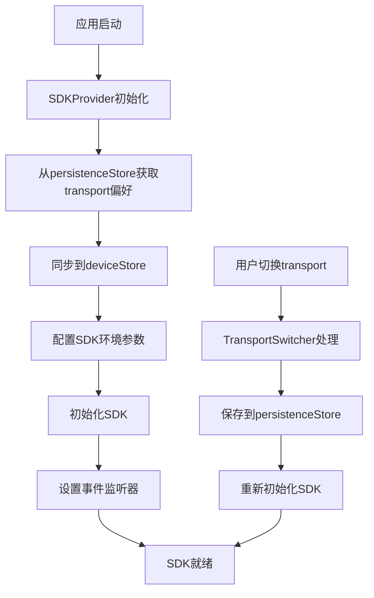

# SDK 初始化流程

## 概述

新的SDK初始化流程确保在应用启动时就正确设置transport类型，避免在各个组件中分散处理transport设置。

## 初始化流程

### 1. SDKProvider 启动
```typescript
// SDKProvider.tsx
export const SDKProvider: React.FC<SDKProviderProps> = ({ children }) => {
  // 在组件初始化时自动启动SDK初始化
  useEffect(() => {
    handleInitializeSDK();
  }, [handleInitializeSDK]);
}
```

### 2. 获取持久化的Transport设置
```typescript
const initializeSDKCore = useCallback(async (): Promise<CoreApi> => {
  // 从持久化存储获取transport设置
  const preferredTransport = usePersistenceStore.getState().getTransportPreference();
  console.log('[SDKProvider] 🚀 使用持久化的transport设置:', preferredTransport);

  // 同步到deviceStore
  const { setTransportType } = useDeviceStore.getState();
  setTransportType(preferredTransport);
}, []);
```

### 3. 根据Transport配置SDK环境
```typescript
// 根据transport类型配置SDK环境
let sdkEnv: ConnectSettings['env'];
switch (preferredTransport) {
  case 'jsbridge':
    sdkEnv = 'web';
    break;
  case 'emulator':
    sdkEnv = 'emulator';
    break;
  case 'webusb':
  default:
    sdkEnv = 'webusb';
    break;
}

const initConfig: Partial<ConnectSettings> = {
  debug: true,
  fetchConfig: true,
  env: sdkEnv,
  connectSrc: CONNECT_SRC,
};
```

### 4. 初始化SDK
```typescript
// 执行SDK初始化
const res = await HardwareWebSdk.init(initConfig);
if (res === false) {
  throw new Error(t('sdk.initError'));
}
sdkInstance = HardwareWebSdk;

// 设置事件监听器
setupSDKEventListeners(sdkInstance);
```

## 组件层面的简化

### TransportSwitcher
- ❌ 移除了transport恢复逻辑
- ✅ 只负责切换transport时的处理
- ✅ 切换后保存到持久化存储

### Sidebar
- ❌ 移除了transport设置同步逻辑
- ✅ 直接使用当前的transport状态
- ✅ 专注于设备连接功能

### hardwareService
- ❌ 移除了复杂的transport获取逻辑
- ✅ 直接从deviceStore获取当前transport
- ✅ transport应该已经在SDK初始化时设置好

## 数据流



## 优势

1. **集中管理**: transport设置在SDK初始化时统一处理
2. **避免竞态条件**: 不再有多个组件同时设置transport的问题
3. **简化组件逻辑**: 各个组件不需要处理transport恢复
4. **一致性**: 确保所有组件使用相同的transport设置
5. **性能优化**: 减少不必要的transport检查和设置

## 注意事项

- SDK初始化是异步的，组件需要检查 `sdkInitState.isInitialized`
- Transport切换会触发SDK重新初始化
- 持久化的transport设置会在应用启动时自动应用
- 如果持久化存储中没有transport设置，会使用默认的 'webusb' 